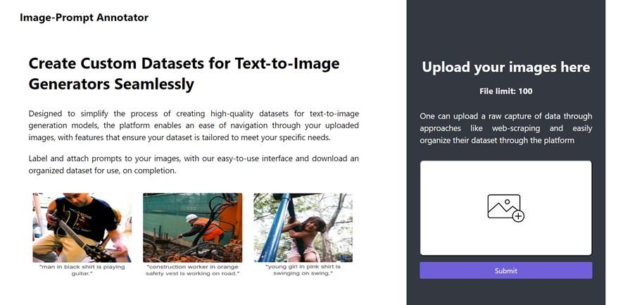
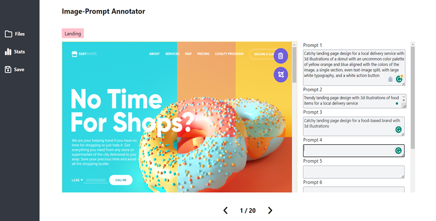
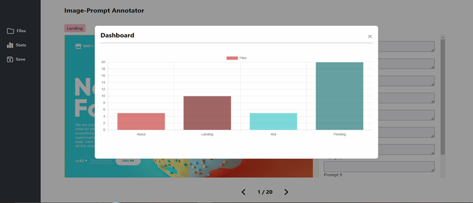

# Annotation_Site
An image annotation tool built with Flask and WebViews, designed to streamline the process of annotating images with captions. **Still in development**, it provides several powerful features for uploading, managing, and annotating datasets, with a focus on ease of use and flexibility. The tool is intended for tasks such as preparing datasets for applications like text-to-image generation. It is also customizable and designed to assist in curating niche datasets for specific projects.







## Features 

- **Dataset Upload & Navigation**: Upload your dataset and navigate through individual files easily. The images are displayed alongside forms for entering prompts, allowing for quick review and annotation.

- **Image Cropping & Editing**: Users can crop images and make modifications directly within the tool. 


- **Progress Tracking:** A progress bar helps you keep track of your annotation progress as you work through the dataset, allowing you to stay organized.

- **Prompt Editing:** Users can cycle back and edit previously entered captions (or "prompts"), making it easy to refine annotations throughout the process.

- **Dashboard & Label Counting:** The tool includes a simple dashboard that tracks and displays the number of images associated with each label, making it easier to monitor your work and ensure consistency.



- **Text File Generation:** For each image, the tool generates a corresponding text file to store the prompt.

- **Save & Download Progress:** The tool allows you to save your progress and download your annotated dataset at any time. If you have incomplete annotations, the download will include a "pending" folder to mark unfinished work.

- **Organized Download Structure:** The downloaded dataset is organized into folders by label, with separate subfolders for images and prompts. The pending folder helps you easily pick up where you left off.

```
downloaded_zip
├── label_1/
│   ├── images/
│   └── prompts/
├── label_2/
│   ├── images/
│   └── prompts/
└── pending/
```

